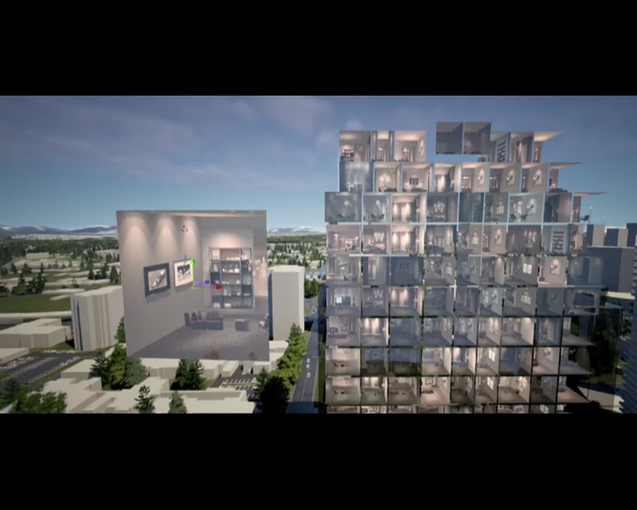

[Home](index.md) | [Projects](Projects.md) 

# Interior Shader

Per NDA, I cannot show you the code of this shader. It was prototyped using **Amplify Shader** and then rewritten in **HLSL** with some adaptations for real-time global illumination (à-la Lumen).

  
  

 

  
  

 

  
  

 

  
  

 

  
  

 
<video controls width="560" style="display: block; margin: 0 auto;">
  <source src="Projects/InteriorShader/UV-BasedInteriorMapping.mp4" type="video/mp4">
</video>
