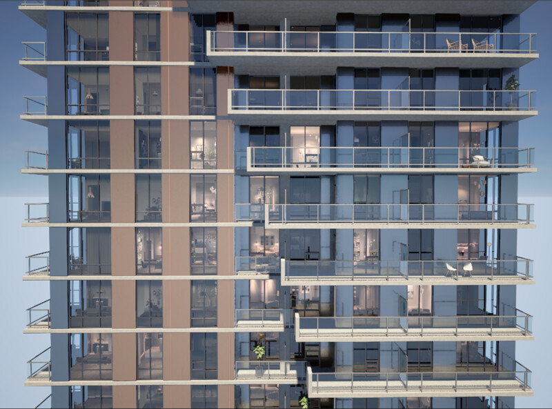
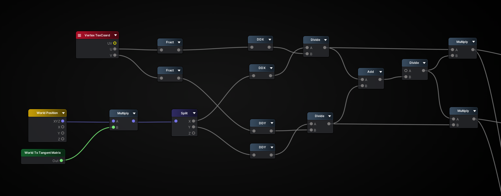
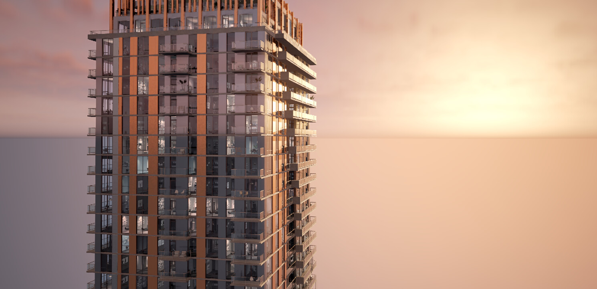

[About Me](index.md) | [Projects](Projects.md) 

# Interior Shader

   

Interior shaders, also called fake interiors, are a rendering technique using multiple parallaxed UV coordinates to simulate depth.
This particular shader features **atlassed textures**: all of the different interiors are compacted on a single, interchangeable "collection" texture of variable size. The curtains are featured on a separate collection. Both of these allow us to adapt to different architectural styles.

> Per NDA, I cannot show you the code of this shader. It was prototyped using **Amplify Shader** and then rewritten in **HLSL** with some adaptations for real-time global illumination (à-la Lumen).  
> The feature is complemented by an automated mapping tool spreading UV into select **udims**

I call them UV-based interiors. The distinction is important because they become much more functionnal if their projection coordinates aren't raw world-space passed as UV, like Triplanar functions do. These need to react to the world *localy* and *by-surface*. 

We achieve this by using the right projection matrix: **WorldToTangent** and multiplying it with our **WorldPosition**, then we divide this with fractionnal parts (**frac**) of our **Vertex Coordinates**, all that's left at this point is to **DDX() DDY()** the previous result. (These functions are derivatives, I've never had college maths so I'm not gonna pretend like I know how it works under the hood) DDX and DDY effectively compare the variations between neighboring pixels and, if done right, ultimately provide us with fully turnable and rotatable surfaces.  

  
That was the hard part! The rest is simply a combination of masks and blends.  

 

  
The effect needs to remain convincing at all hours during the simulation.  

Notice how the appartments on the extremities of the building are see-through. This is achieved using reserved udims.

The very first iteration of the shader used a color map for randomization and coloration but even a big color map wasn't sufficent; humans are too good at pattern recognition.
So I used one of these mathematical functions: ceil, floor, trunc or round with multiple single single-channel noise generators to produce truly convincing random patterns.

  
 
   

Here's a more in-depth rundown of what the shader can do:

<video controls width="560" style="display: block; margin: 0 auto;">
  <source src="Projects/InteriorShader/UV-BasedInteriorMapping.mp4" type="video/mp4">
</video>
