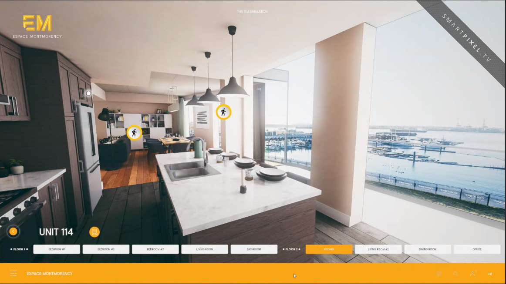
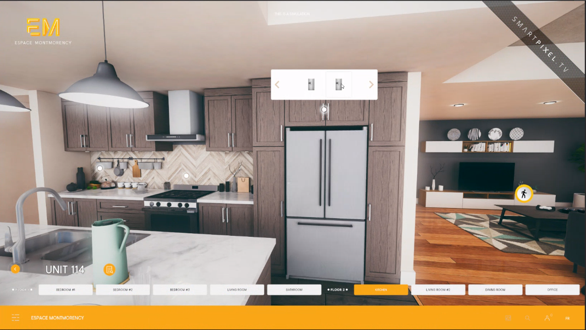
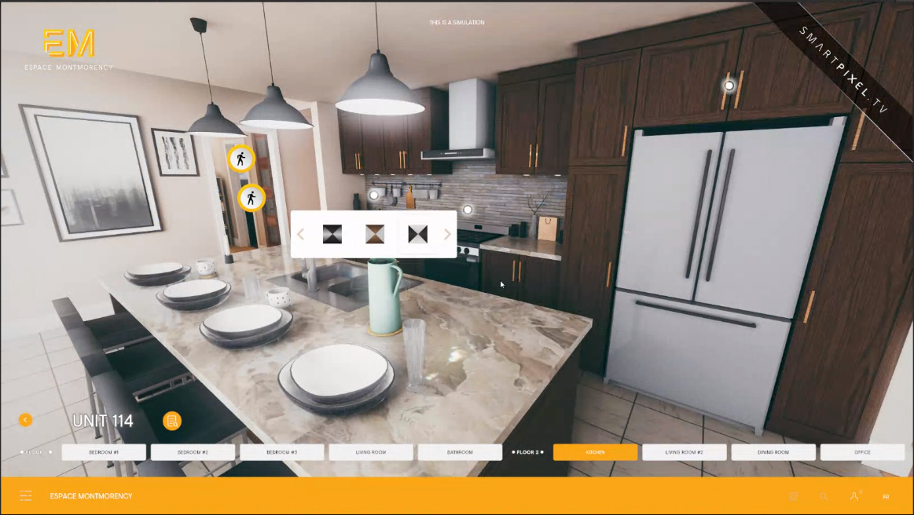
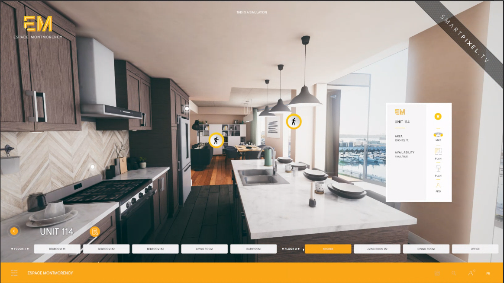

[Home](index.md) | [Projects](Projects.md) 

# Interior Lightbaking

At some point I was given a few days to systemize and document interior lightbaking for real-time navigable environments these are some of the shots from these experiments. 
The models were provided by my colleagues.

> shot in **Unity** baked using **Bakery** 

This is my favorite shot of them all, despite the fact it was taken for documentation purposes to show how transparent objects (curtains) needed special treatment; to be on their own layer.
  
  

 

Unity's HDR-compatible shader (also known as **Skybox material**) is extremely rudimentary, so I thought good to craft a more potent one. This is a lot more important than it seems for 2 reasons:  
1. Archviz clients aren't just selling space, in most cases, they're selling *a view*   
2. HDRI have a huge impact on ambiant lighting.  
They would likely not provide proper HDRI, but stitched-up drone images, so we had to consider the worst of inputs and scales.  
<video controls width="560" style="display: block; margin: 0 auto;">
  <source src="Projects/Interiors/HDRI_Controller.mp4" type="video/mp4">
</video>

  
  

 

These apps doubled-down as interior design tools in which end-clients could pick and choose which finish to give to their countertops, cupboards etc.
Considering lightbounces, all interchangeable assets had to be baked with neutral colors.  non-physical trick lights could then be added to the mix to compensate, but we've never had to push it this far.

 

  
Different styling, same kitchen  

 

Caustics from the glass were just 2 quads with chromatic aberation surface shaders. Decals were not featured in the engine at the time.

  
  

 

  
  

 

