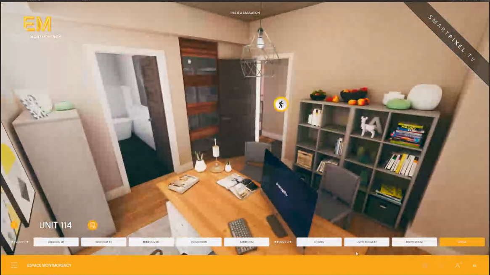

[Home](index.md) | [Projects](Projects.md) 

# Interior Lightbaking

At some point I was given a few days to systemize and document interior lightbaking these are some of the shots from these experiments.

  
This is the hard part, the rest is just masks and blends  

 

  
This is the hard part, the rest is just masks and blends  

 

  
This is the hard part, the rest is just masks and blends  

 

  
This is the hard part, the rest is just masks and blends  

 

  
This is the hard part, the rest is just masks and blends  

 

  
This is the hard part, the rest is just masks and blends  

 

  
This is the hard part, the rest is just masks and blends  

 

<video controls width="560" style="display: block; margin: 0 auto;">
  <source src="Projects/Interiors/HDRI_Controller.mp4" type="video/mp4">
</video>
