[About Me](index.md) | [Projects](Projects.md) 

# Realtime Environmental Lighting

> Done in the **Unity** engine, using our in-house lighting tools.

For this project I worked on cameras, lighting, materials, numerous shaders and post-processing.  
 
<video controls width="560" style="display: block; margin: 0 auto;">
  <source src="Projects/InteriorShader/Lighting.mp4" type="video/mp4">
</video>
 

This was the first outside of the prototype box to use **physicaly-based lighting** with realtime GI (global illumination) and lightbounces inspired by Unreal's Lumen and developped completely in-house that we served to an actual client, it was exciting to work on.  
I think I went back and forth on the fog curve like 12 times. We must have retoned the trees 4 times.  
I've been told that years later this is still the lighting benchmark within the company.  

If you want to see more, you can visit https://www.smartpixel.com/ or their Youtube page,  
I've had a hand in more than 50 of their projects all over the world:  

As Lighting Lead, I often advocated for matching the colors of 3D UI elements (which were under our responsibility) to respect the client's visual identity as closely as possible.  
> [3D Sales App for Real Estate Property La Citta](https://www.youtube.com/live/u4jk0Vfm5gg)  
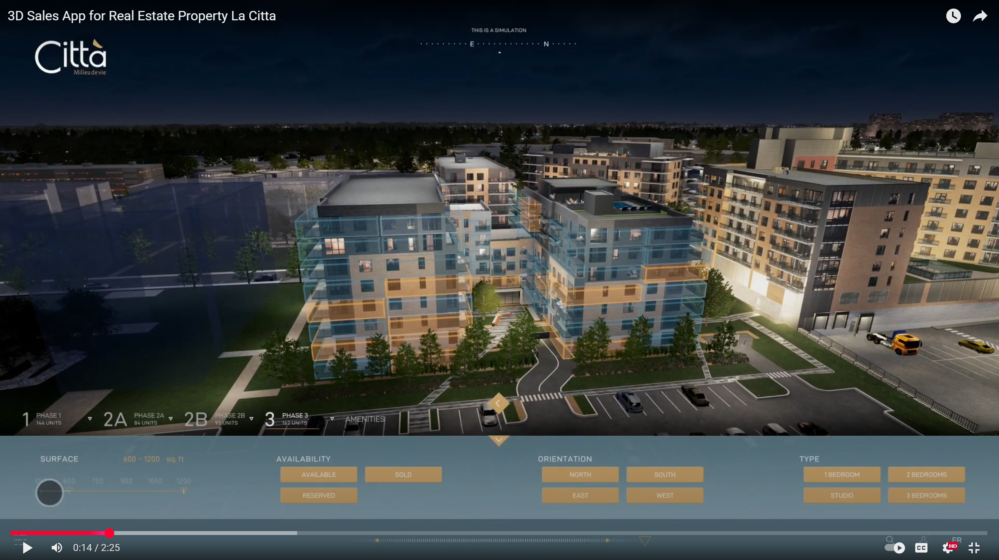  

 
 

I worked very hard on the modeling, stylization, lighting and vfx on this project's environment.    
The client wanted to display an interconnected, pulsating city, powered by their service.  
> [Comcast: 3D Interactive Tour of a Digital City](https://www.youtube.com/watch?v=8_HSRpEftAk)  
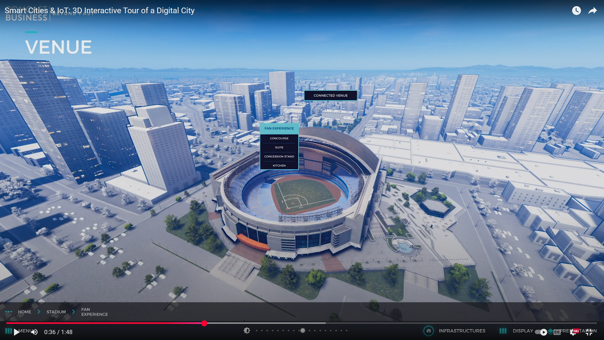  
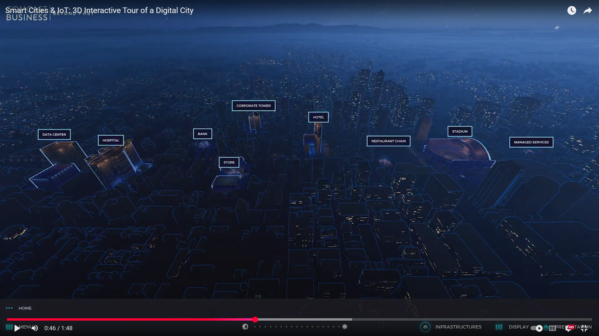  

 
 

> [ABB - Landscapes: Interactive Portfolio](https://www.youtube.com/live/HtmBWIdutX4)  
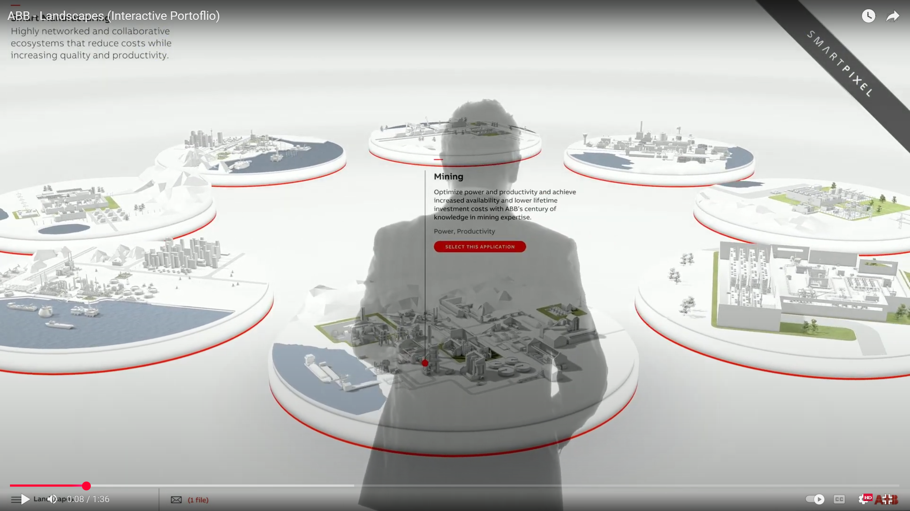  

 
 

> [Interactive 3D Sales Tool for Harmonia Condos Real Estate Project](https://www.youtube.com/live/f1MLiwH65rA)  
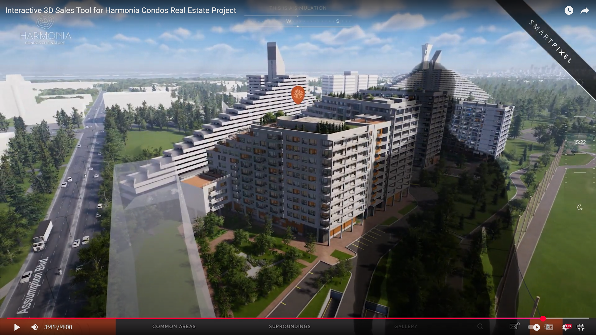  

 
 

> [Al Marjan Island - Interactive Real Estate Application](https://www.youtube.com/live/_gLVd84uaDU)  
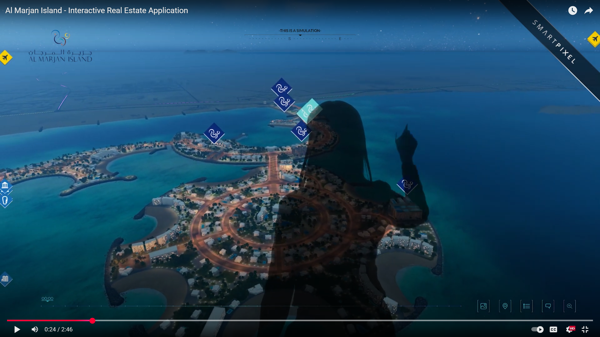  

## Editorial on cameras
My job as lighting artist extends to positionning and editing cameras' field of freedom.
The user is more often than not in control of the camera, **but**, we do control the landing view in which those cameras will set themselves up and this way, we can make full use of vanishing points and perspective lines to really bring out our subject. Similarly, in a videogame, this happens when players enter a new room  

### UX strain
seizing camera control from the user creates strain and there are some cryptic rules to this.  
Consider the contextual change in archviz from the view of the main building to the same building's environment view.  In this context you DO NOT want any yaw change but in the context of going to see the pool from the garden, for example, it will be perfectly acceptable.  

### Touch screen controls and Orbit cameras
One stapple feature of archviz apps are orbit cameras, it is slightly more desirable to have orbit cameras behave in a turntable fashion with touchscreens. So if you touch-drag (or click-drag) from right to left, the foreground follows from right to left, and the background goes the opposite way, from left to right.  
That is true for 3rd person views. In any 1st person view, in order for this to feel consistent, you will need to *invert the drag function*.  

# Realtime Interior Lighting

I was given a few days to systemize and document interior lightbaking for real-time navigable environments. The following pictures are some of the shots from these experiments. 
All 3D models were provided by my colleagues. 
I did all lighting, performance optimisations and lightbaking in this project.

> Shot in **Unity**. Baked using [Bakery](https://assetstore.unity.com/packages/tools/level-design/bakery-gpu-lightmapper-122218)

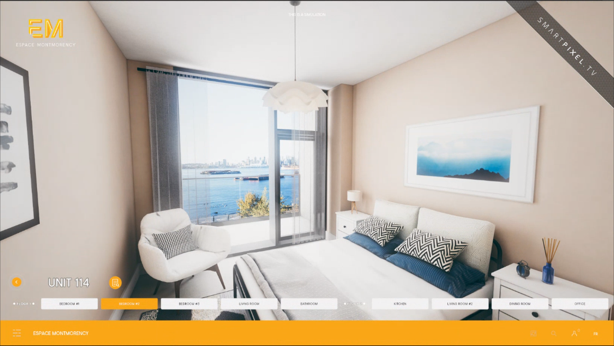  

I'm going to break this shot down.
It is crucial in lighting not to shy out in correcting surface colors and physical properties, it all factors in, more so than ever now that game engines feature realtime GI.
In this case I made a "triangle of focus" by exploiting a color callback of blue hues that are hightened by the subtle oranges of the light beige walls, contrasting by saturation the desaturated elements in the background. The eye naturaly navigates from the outside view, to the painting and then to the vases and pillows.  

### skyboxes

Unity's HDR-compatible shader (also known as **Skybox material**) is extremely rudimentary. We needed to craft a more potent one. This is a lot more important than it seems for 2 reasons:  
1. Archviz's clients aren't just selling space. In most cases, they're selling *a view*.
2. HDRI have a huge impact on **ambiant lighting**.

We knew that clients would likely not provide proper HDRI or often stitched-up drone images instead. Therefore, we had to prepare for odd colorings, distortions, misorientations and off-positionning.   
<video controls width="560" style="display: block; margin: 0 auto;">
  <source src="Projects/Interiors/HDRI_Controller.mp4" type="video/mp4">
</video>

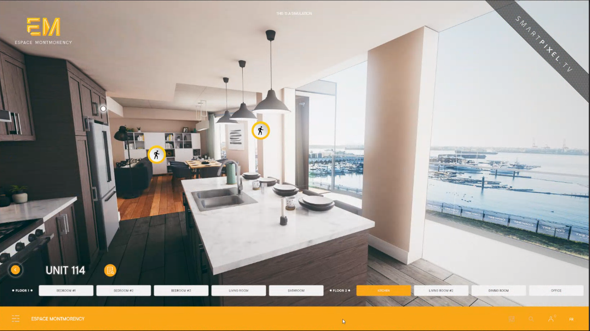  

These apps doubled-down as interior design tools in which customers could pick and choose which finish to give to their countertops, cupboards etc.
Considering light bounces, all interchangeable assets had to be baked with neutral colors.

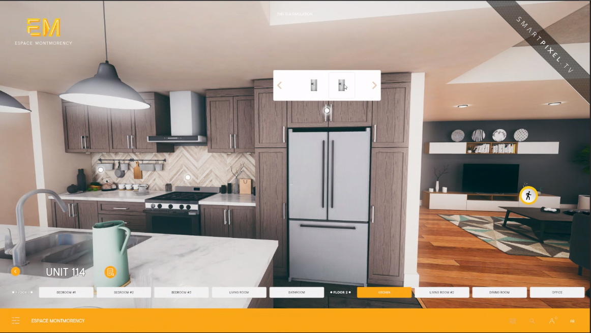   

Caustics from the glass were only 2 quads with chromatic aberation surface shaders. Decals were not featured in the engine at the time.

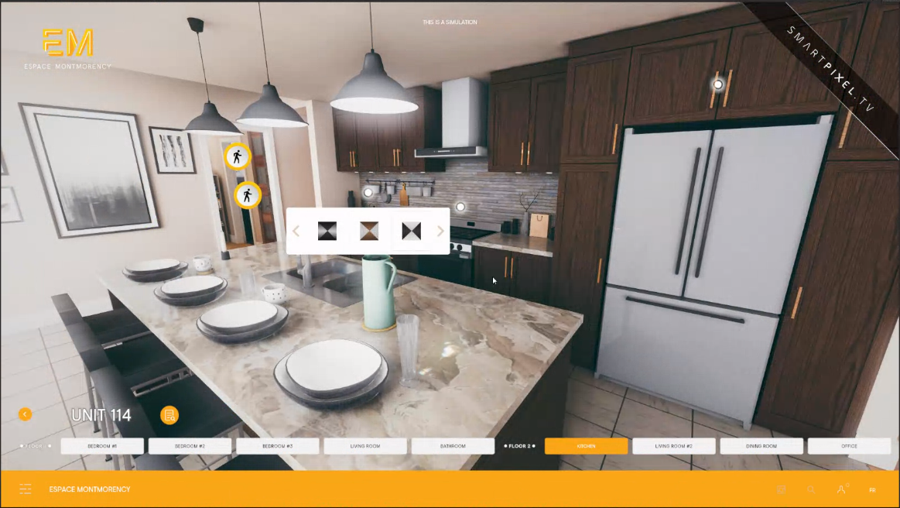  

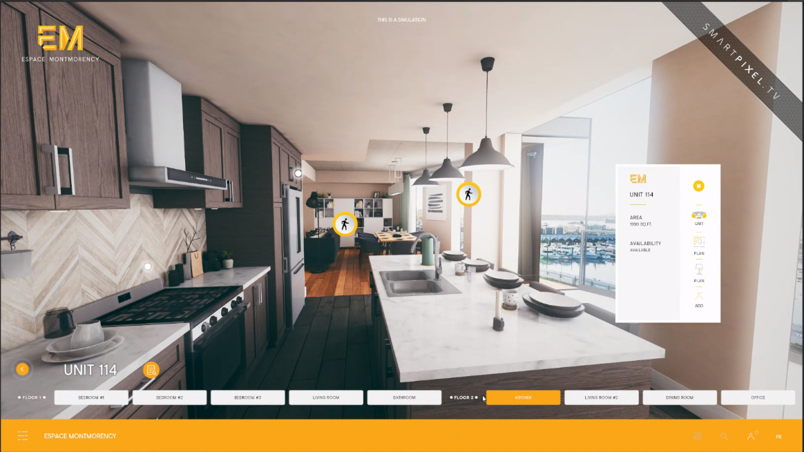  

