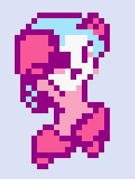

[Home](index.md) | [Projects](Projects.md) 

## Wanna play some Megan, man?
Megan is a fun little pixelart platformer project that I use to test whatever comes to mind.  
This was never meant to be a portfolio piece (but here we are). It was designed to quench **The Thirst**, the thirst for making games.  

> **Aseprite** and **Pixly** were used to create the sprites.  
> Most of the code was done using visual scripting in **Unity**.  

## Technical features:
> Here are some of the interresting technical features in the game.

### Pooling
Megan's trail rendering is composed of pooled objects to avoid the unnecessary CPU burden of repeatedly creating and destroying lots of objects.  
Here is how I approached the feature:
1. A Parent Gameobject hosts the trail mimics
2. A Trail Function sends Events to the Trail Mimics
3. The system runs on a shared FINISH ME HERE

As long as the Trail Function is present in the desired state of the state machine, the trails will spawn

Monobehaviors, visual script machines in my case, on the Trail Mimics manage the effect 

the effect can easily be restyled by simply changing the effect bloc. 

The objects themselves arent deactivated, to allow direct targetting, their renderer is disabled instead.

[give it a spin!](https://croquettelunchers.github.io/Megan/)  

  
Megan Controls: 🔽

| Action | Info | Keyboard Controls | Controller Controls |
|--------|------|-------------------|---------------------|
| Movement | | | |
| Jump | | Space | South Button |
| Walk | | A or D | Left, Right |
| Crouch | | S | Down |
| Slide | | S + Space | Down + South Button |
| Sprint | | Row 1B | Row 1C |
| Cling to walls | Touch a wall while falling | Row 2B | Row 2C |
| Actions | | | |
| Shoot charged shots | Charged shots only for now, maybe, who knows? | Press and hold Q or K, then release | Press and hold Button West, then release |
| Grab (or rip) | Nearby things in front or under her | Q or K | Button West |
| Throw | Or drop things when grounded | Q or K | Button West |
| Smash held items | Press repeatedly to pump up a smash to insane proportions while airborne | Q or K | Button West |
| Poyo Transform! | Turn her friend Poyo the flying bird into a soccer ball | O | R2 |
| Kick | Kick soccer balls straight, with a curve and dragon-kick 'em in the air | J | L1 |
| Dribble the ball | Reacts to jumps and slides | | |
| Hack | Hack into some larger enemies and Consoles to take control of them by standing on top of them | | |
| Stop hacking | Stop hacking by jumping out | Space | Button South |
| Switch to V | Change character | Right Shift | |

  

 
Here are a few notes about the design🔽

     
I'm challenging myself to avoid direct double jumps and walljumps.   
The Charged Shot is intentionnaly constrained in favor of environmental weaponry.  
There is a lot of feedback on most actions, that is to convey weight and 

   

  

  

 
Display Gallery🔽

    <video controls width="400" style="display: block; margin: 0 auto;">
  <source src="Projects/Megan/MeganSprints.mp4" type="video/mp4">
        Megan Sprints
</video>
    <video controls width="400" style="display: block; margin: 0 auto;">
  <source src="Projects/Megan/MeganSlides.mp4" type="video/mp4">
        Megan Slides
</video>
    <video controls width="400" style="display: block; margin: 0 auto;">
  <source src="Projects/Megan/MeganGrabs.mp4" type="video/mp4">
        Megan Grabs
</video>
    <video controls width="400" style="display: block; margin: 0 auto;">
  <source src="Projects/Megan/MeganThrows.mp4" type="video/mp4">
        Megan Throws
</video>
    <video controls width="400" style="display: block; margin: 0 auto;">
  <source src="Projects/Megan/MeganScandalousSmash.mp4" type="video/mp4">
        Scandalous Smashes
</video>
    <video controls width="400" style="display: block; margin: 0 auto;">
  <source src="Projects/Megan/MeganRepeatedJumps.mp4" type="video/mp4">
        Smash-a-jumping
</video>
    <video controls width="400" style="display: block; margin: 0 auto;">
  <source src="Projects/Megan/MeganRipsAndHacks.mp4" type="video/mp4">
        Megan Rips and Hacks
</video>
    <video controls width="400" style="display: block; margin: 0 auto;">
  <source src="Projects/Megan/MeganHardcoreDeathnimation.mp4" type="video/mp4">
        Megan hardcore death animation
</video>
    <video controls width="400" style="display: block; margin: 0 auto;">
  <source src="Projects/Megan/MeganFisticuffs.mp4" type="video/mp4">
        Megan Fisticuffs
</video>
    <video controls width="400" style="display: block; margin: 0 auto;">
  <source src="Projects/Megan/MeganFisticuffRandomness.mp4" type="video/mp4">
        Megan Fisticuff Randomness
</video>
    <video controls width="400" style="display: block; margin: 0 auto;">
  <source src="Projects/Megan/MeganSoccer.mp4" type="video/mp4">
        Megan Soccer
</video>

  

I made some music using Ableton
 
 
 
<audio controls>
  <source src="Projects/Megan/MegamanCharacterSelectScreen3.wav" type="audio/wav">
    PS1-Style
</audio>
<audio controls>
  <source src="Projects/Megan/CharacterSelect.mp3" type="audio/mpeg">
    NES-Style
</audio>

