[About Me](index.md) | [Projects](Projects.md) 

# Retro-styled Video Game Prototype

> 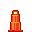Wanna play some Megan, man?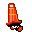

  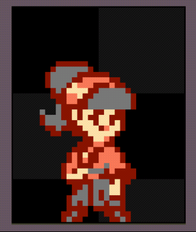
  "Megan" is a fun little pixel art platformer project that I use as a test bed for whatever comes to mind.  
  This was never meant to be a portfolio piece (but here we are). It was designed to quench <em>The Thirst</em>. The thirst for making games.  

  
A few notes about the design

  <ul style="padding-top: 10px;">
    <li>I'm challenging myself to avoid direct double jumps and wall jumps.</li>
    <li>The Charged Shot is intentionnaly constrained in favor of environmental weaponry.</li>
    <li>There is a lot of feedback on most actions; landing lag, knockback on the charged shot and punches, are features used to convey <em>weight</em>.</li>
    <li><em>Grace time</em> when grabbing objects while airborne is a crucial detail to make the feature fun.</li>
  </ul>
  
I'm also trying to follow MetalWarriors' or DeadSpace's <em>no UI</em> philosophy and convey as much as possible through in-game elements:

  <ul>
    <li>When Megan goes on cooldown from firing, 3 puffs appear. This is actualy timing for the next available shot.</li>
    <li>Megan's hurt animation changes according to how many hit points she has left. Drawing inspiration from Symphony of the night</li>
    <li>Megan leaks smoke according to how many hit points she has left.</li>
    <li>Megan starts sparking up when she's down to her last hit point.</li>
  </ul>

  
Features Gallery

  <video controls width="580" style="display: block; margin: 0 auto; padding-top: 15px">
    <source src="Projects/Megan/MeganSprints.mp4" type="video/mp4"> 
  </video>
  
Megan Sprints

  
  <video controls width="580" style="display: block; margin: 0 auto;">
    <source src="Projects/Megan/MeganSlides.mp4" type="video/mp4">
  </video>
  
Megan Slides

  
  <video controls width="580" style="display: block; margin: 0 auto;">
    <source src="Projects/Megan/MeganGrabs.mp4" type="video/mp4">
  </video>
  
Megan Grabs

  
  <video controls width="580" style="display: block; margin: 0 auto;">
    <source src="Projects/Megan/MeganThrows.mp4" type="video/mp4">
  </video>
  
Megan Throws

  
  <video controls width="580" style="display: block; margin: 0 auto;">
    <source src="Projects/Megan/MeganScandalousSmash.mp4" type="video/mp4">
  </video>
  
Scandalous Smashes

  
  <video controls width="580" style="display: block; margin: 0 auto;">
    <source src="Projects/Megan/MeganRepeatedJumps.mp4" type="video/mp4">
  </video>
  
Smash-a-jumping

  
  <video controls width="580" style="display: block; margin: 0 auto;">
    <source src="Projects/Megan/MeganRipsAndHacks.mp4" type="video/mp4">
  </video>
  
Megan Rips and Hacks

  
  <video controls width="580" style="display: block; margin: 0 auto;">
    <source src="Projects/Megan/MeganHardcoreDeathnimation.mp4" type="video/mp4">
  </video>
  
Megan hardcore death animation

  
  <video controls width="580" style="display: block; margin: 0 auto;">
    <source src="Projects/Megan/MeganFisticuffs.mp4" type="video/mp4">
  </video>
  
Megan Fisticuffs

  
  <video controls width="580" style="display: block; margin: 0 auto;">
    <source src="Projects/Megan/MeganFisticuffRandomness.mp4" type="video/mp4">
  </video>
  
Fisticuff Randomness
 
  
  <video controls width="580" style="display: block; margin: 0 auto;">
    <source src="Projects/Megan/MeganSoccer.mp4" type="video/mp4">
  </video>
  
Megan Soccer

  

> [Aseprite](https://www.aseprite.org/) and Pixly were used to create the sprite artwork.  
> Most of the code was done using visual scripting in **Unity**.  

<video controls width="580" style="display: block; margin: 0 auto; 20 px auto;">
  <source src="Projects/Megan/LilVAims.mp4" type="video/mp4"> 
</video>  

## Live Demo

Try it yourself! Play it live with Unity WebGl's player on your browser using your keyboard, game controller or on your mobile device.

<a href="https://croquettelunchers.github.io/Megan/" class="playGame">
  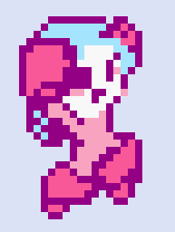Give it a spin!
</a>

[Megan Controls](MeganControls.md)

## Technical features:

### Pooling
Megan's **trail rendering** is composed of pooled objects to avoid the unnecessary **CPU burden** of repeatedly creating and destroying lots of objects.  
Here is how I approached the feature:
1. A Parent Gameobject hosts the Trail Mimics.
2. A Trail Function sends Events to the Trail Mimics.
3. The Trail Mimics receive the event and manage how the effect looks and occurs.

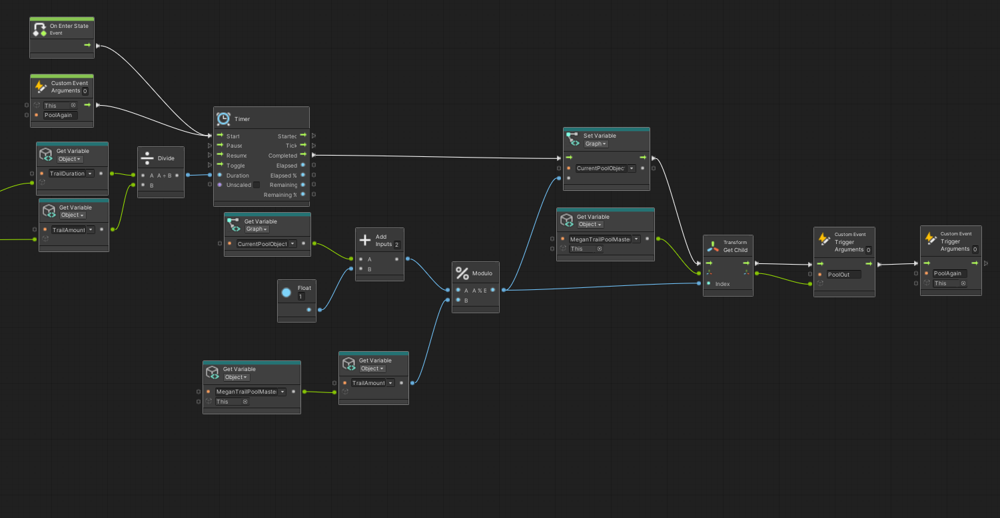  

This is the main trail function coded with Bolt visual scripting.

Forming the **frequency** to send pooling events is this: Trail duration / the total number of trail objects.  
That timespan is fed to a **Timer** which corresponds to an **IEnumerator coroutine** in regular C# code.   
To determine which Trail Mimic to send the event to: I'm using a common **modulo**: (The current pooled object +1) % The total amount of pooled objects.  
Update "The current pooled object" variable.   
The timer is then refreshed every time it completes its cycle.  

- As long as the Trail Function is present in the desired state on the state machine, the trails will spawn.  
- The effect can easily be **re-styled** by simply changing the effect bloc. 
- The objects themselves aren't deactivated or destroyed, to allow **direct referencing**. Their renderer is **disabled** instead.

### Color Palette conforming: LUT
In accordance with the **artistic direction** I picked for this project, I'm using the **NES palette** to get that Megaman retro feel.  
I did so by using a **LUT**, or Look up table reference.  
This method provides many benefits: since the LUT is occuring localy (as opposed to globaly using post-processing), it can be left out of some shaders that would never need this, like particles.  
Colors can be tweened dynamicaly and always remain compliant with the artistic direction.  

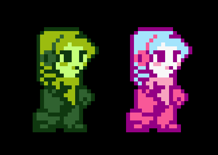  
A Gameboy LUT Megan next to her NES counterpart.

Since Texture Samplers' UV coordinates can be boiled down to simple gradient information I use it in Surface Shading to remap the incoming sprites and their color info into another texture sample as UV, effectively constraining our material to displaying only using a specific palette.  
Now, UVs are **Vector2 coordinates** and colors are Vector3 so we need to crunch down one of our channels somehow.  
I chose to collapse the Blue color channel onto the Red one, this is what the prototype version looks like:   

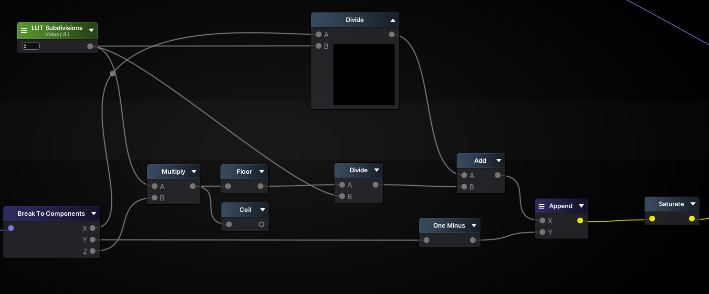  
And this is the texture the UV are being fed to:  
  
<spanp style="color: gray;">An excessively more precise version of it is used, when needed.

The more **subdivisions**, the more precise the LUT works.  
Photoshop and Aseprite have the capacity to convert images to **Indexed colors**, that's the secret sauce.  

LUTs applied this way are **lossy**, meaning they apply an explicit destruction of information, rendering this method much less desirable in a high-fidelity, AAA production context.

### Megan's Statemachine

Visual scripting's State machines makes coding character behavior a breeze.  
States are commonly composed of 4 parts:  
1. Inputs; which controls or conditions are being checked for in current state.
2. Logic nodes; determining what to do with them.
3. Animation branch; sending signals to the animator.
4. A Function repository; these are common functions that are "true" or used in this state. i.e.: The walk function is present in the "holding things" state.

For improved fluidity it's important to leave as much code as possible outside of the Update loop and to trigger things as directly and contextualy as possible. To do so, a lot of information (or checks) gets encapsulated into variables, such as what Megan is stepping on and if she is currently grounded. Once these checks are turned into functions, I can also restrict when they occur.

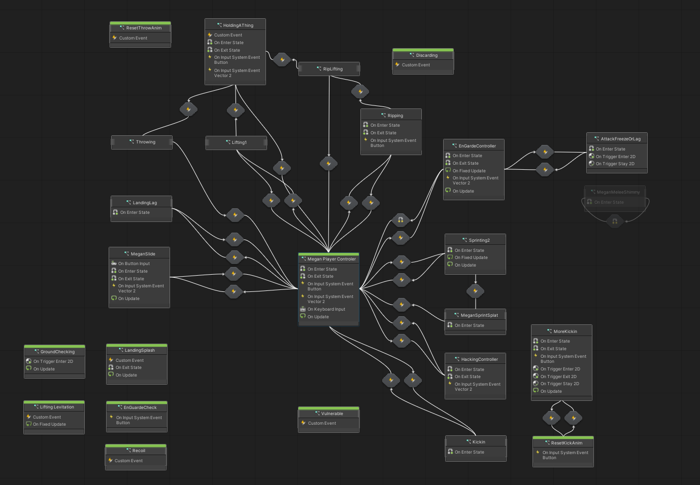  
Megan's core state machine 

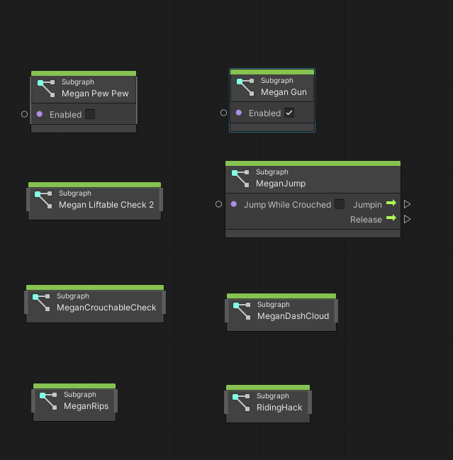  
Megan's main state function repository  

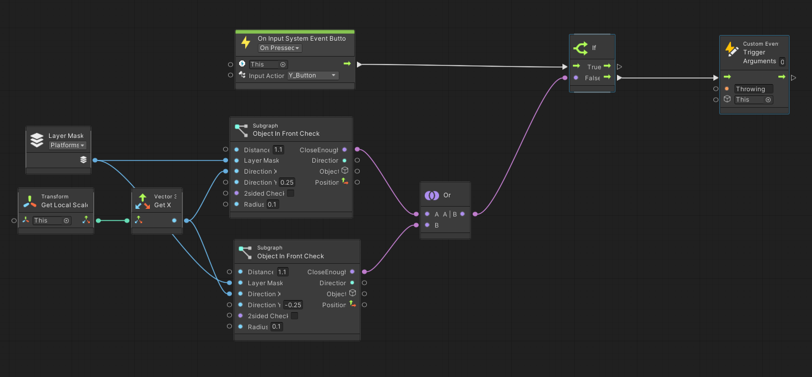  

Useful Functions like these help recycle features accross objects and states. i.e.: the OneHP function triggers Death upon receiving any amount of damage.  
Well-made functions dramaticaly speed up the development and testing of features. One of my favourite function is "Play until animation is over" which can be used to automaticaly destroy or deactivate sprite-based animated objects.  

### Megan's Animator

Megan's character features **60 animation states** (at the time this was written) ranging from 1 to 12 frames each, which is admittedly far more than what is reasonnable to expect from an original NES cartridge.  
2 things have helped me manage all of these animations:
**Animation Indexes** and **Blend States**. 

What I call Animation Indexes are states in an animator featuring lots of animations that are (almost) entirely dependent on a single integer to run. The goal is to reduce what other people have dubbed "**animator hell**" that naturaly occurs when an animator is trying to do too much logic, resulting in an extremely complicated web in the animator.

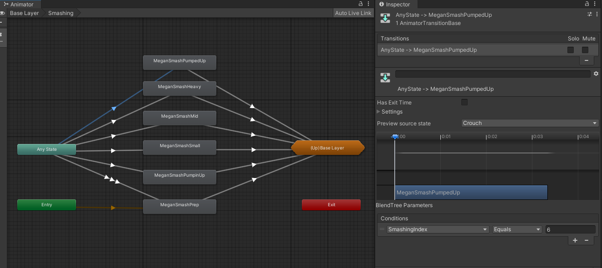  
The Smashing Index and its state.  

Animator **Blend states** are meant to handle complex compound movements but they also find their use in sprite handling when animations need to run in a parallel fashion. In the example below, Megan's walk animation won't stumble (or reset) when charging a shot, shooting or being on cooldown from firing.

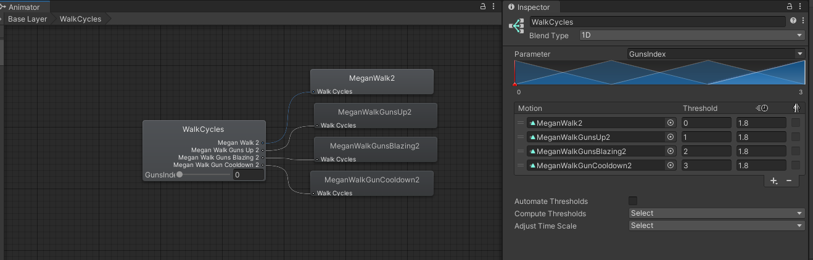  
Walk cycles.

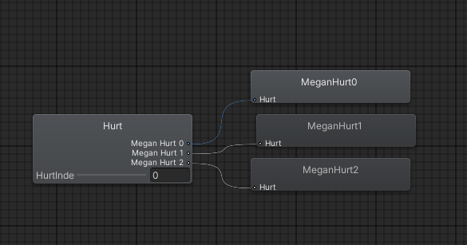  
Other uses for blend states.

## Soundtrack
 
As a part-time musician I also composed a few tracks for the game using [Ableton](https://www.ableton.com/).

<audio controls>
  <source src="Projects/Megan/MegamanCharacterSelectScreen3.wav" type="audio/wav">
    PS1-Style
</audio>
<audio controls>
  <source src="Projects/Megan/CharacterSelect.mp3" type="audio/mpeg">
    NES-Style
</audio>

