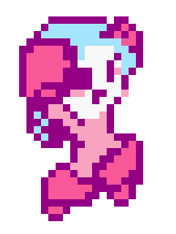

[Home](index.md) | [Projects](Projects.md) 

## Wanna play some Megan, man?
Megan is a fun little pixelart platformer project that I use to test whatever comes to mind.  
This was never meant to be a portfolio piece (but here we are). It was designed to quench **The Thirst**, the thirst for making games.  

> **Aseprite** and **Pixly** were used to create the sprites.  
> Most of the code was done using visual scripting in **Unity**.  

## Technical features:

### Pooling
Megan's **trail rendering** is composed of pooled objects to avoid the unnecessary **CPU burden** of repeatedly creating and destroying lots of objects.  
Here is how I approached the feature:
1. A Parent Gameobject hosts the Trail Mimics
2. A Trail Function sends Events to the Trail Mimics
3. The Trail Mimics receive the event and manage how the effect looks and occur 

  

This is the main trail function, apologies for PascalCase variables in this project

Forming the **frequency** to send pooling events is this: Trail duration / the total number of trail objects.
That timespan is fed to a **Timer** which corresponds to an **IEnumerator coroutine** in regular C# code, 
To determine which Trail Mimic to send the event to, I'm using a common modulo: (The current pooled object +1) % The total amount of pooled objects.
Update "The current pooled object" variable.
the timer is then refreshed every time it completes its cycle.

- As long as the Trail Function is present in the desired state of the state machine, the trails will spawn  
     Mine is on the root state because I should be stopped.
- the effect can easily be restyled by simply changing the effect bloc. 
- The objects themselves arent deactivated, to allow direct referencing, their renderer is disabled instead.

 
---
 

### Color Palette conforming: LUT
In accordance with the **artistic direction** of the project, I'm using the **NES palette** to get that Megaman retro feel.  
I did so by using a **LUT**, or Look up table reference.  
This method provides many benefits: since the LUT is occuring localy (as opposed to globaly using post-processing), it can be left out of some shaders that would never need this, like particles.  
Colors can be tweened dynamicaly and always be compliant with the artistic direction.  

  
 a Gameboy LUT Megan next to her NES counterpart.

Since Texture Samplers' UV coordinates can be boiled down to simple gradient information, I use that in Surface Shading to remap the incoming sprites and their color infos into another texture sample as UV, effectively constraining our material to displaying only using a specific palette.
Now, UVs are Vector2 coordinates and colors are Vector3 so we need to crunch down one of our channels somehow.  
I chose to collapse the Blue color channel onto the Red one, this is what the proto version looks like:   
  
and this is the texture the UV are being fed to:  
  
an excessively more precise version of it is used, when needed  

I will not go over the creation of the texture, but the more **subdivisions** the more precise the LUT works.  
Photoshop and Aseprite have the capacity to convert images to **Indexed colors**, that's the secret of the sauce.  

 
 

### Megan's Statemachine

Visual scripting State machines make coding character behavior a breeze.  
States are commonly composed of 4 parts:  
1. Inputs; which controls or conditions are being checked for in current state.
2. Logic nodes; determining what to do with them.
3. Animation branch; sending signals to the animator.
4. a Function repository, these are common functions that are "true" or used in this state. ex.: The walk function is present in the "holding things" state.

  
Megan's core state machine 

  
Megan's main state function repository  

  
Useful Functions  
functions like these help recycle features accross objects and states. ex.: the OneHP function trigger Death upon receiving any amount of damage.  
Well-made functions dramaticaly speed up the development and testing of features. One of my favourite function is "Play until animation is over" which can be used to automaticaly destroy or deactivate sprite-based animated objects. 

### Megan's Animator

Megan's character features **60 animation states** (at the time this was written) ranging from 1 to 12 frames each, which is a admittedly far more than what is reasonnable to expect from an original NES cartridge.  
2 things have helped me manage all of these animations:
**Animation indexes** and **Blend states**. 

  
Useful Functions  

  
Useful Functions  

 
 

[give it a spin!](https://croquettelunchers.github.io/Megan/)  

 

  
Megan Controls: 🔽

| Action | Info | Keyboard Controls | Controller Controls |
|--------|------|-------------------|---------------------|
| Movement | | | |
| Jump | | Space | South Button |
| Walk | | A or D | Left, Right |
| Crouch | | S | Down |
| Slide | | S + Space | Down + South Button |
| Sprint | | Row 1B | Row 1C |
| Cling to walls | Touch a wall while falling | Row 2B | Row 2C |
| Actions | | | |
| Shoot charged shots | Charged shots only for now, maybe, who knows? | Press and hold Q or K, then release | Press and hold Button West, then release |
| Grab (or rip) | Nearby things in front or under her | Q or K | Button West |
| Throw | Or drop things when grounded | Q or K | Button West |
| Smash held items | Press repeatedly to pump up a smash to insane proportions while airborne | Q or K | Button West |
| Poyo Transform! | Turn her friend Poyo the flying bird into a soccer ball | O | R2 |
| Kick | Kick soccer balls straight, with a curve and dragon-kick 'em in the air | J | L1 |
| Dribble the ball | Reacts to jumps and slides | | |
| Hack | Hack into some larger enemies and Consoles to take control of them by standing on top of them | | |
| Stop hacking | Stop hacking by jumping out | Space | Button South |
| Switch to V | Change character | Right Shift | |

  

 
Here are a few notes about the design🔽

     
- I'm challenging myself to avoid direct double jumps and walljumps. Please bear with me.   
- The Charged Shot is intentionnaly constrained in favor of environmental weaponry. 
- There is a lot of feedback on most actions, landing lag, knockback on the charged shot and punches, are features used to convey weight. 
- grace time when grabbing objects while airborne is a crucial detail to make the feature fun. 

  

  

 
Display Gallery🔽

    <video controls width="580" style="display: block; margin: 0 auto;">
  <source src="Projects/Megan/MeganSprints.mp4" type="video/mp4"> 
</video>
Megan Sprints
    <video controls width="580" style="display: block; margin: 0 auto;">
  <source src="Projects/Megan/MeganSlides.mp4" type="video/mp4">
</video>
Megan Slides
    <video controls width="580" style="display: block; margin: 0 auto;">
  <source src="Projects/Megan/MeganGrabs.mp4" type="video/mp4">
</video>
Megan Grabs
    <video controls width="580" style="display: block; margin: 0 auto;">
  <source src="Projects/Megan/MeganThrows.mp4" type="video/mp4">
</video>
Megan Throws
    <video controls width="580" style="display: block; margin: 0 auto;">
  <source src="Projects/Megan/MeganScandalousSmash.mp4" type="video/mp4">
</video>
Scandalous Smashes
    <video controls width="580" style="display: block; margin: 0 auto;">
  <source src="Projects/Megan/MeganRepeatedJumps.mp4" type="video/mp4">
</video>
Smash-a-jumping
    <video controls width="580" style="display: block; margin: 0 auto;">
  <source src="Projects/Megan/MeganRipsAndHacks.mp4" type="video/mp4">
</video>
Megan Rips and Hacks
    <video controls width="580" style="display: block; margin: 0 auto;">
  <source src="Projects/Megan/MeganHardcoreDeathnimation.mp4" type="video/mp4">
</video>
Megan hardcore death animation
    <video controls width="580" style="display: block; margin: 0 auto;">
  <source src="Projects/Megan/MeganFisticuffs.mp4" type="video/mp4">
</video>
Megan Fisticuffs
    <video controls width="580" style="display: block; margin: 0 auto;">
  <source src="Projects/Megan/MeganFisticuffRandomness.mp4" type="video/mp4">
</video>
Megan Fisticuff Randomness
    <video controls width="580" style="display: block; margin: 0 auto;">
  <source src="Projects/Megan/MeganSoccer.mp4" type="video/mp4">
</video>
Megan Soccer

  

 
 
I made some music using Ableton
 
 
 
<audio controls>
  <source src="Projects/Megan/MegamanCharacterSelectScreen3.wav" type="audio/wav">
    PS1-Style
</audio>
<audio controls>
  <source src="Projects/Megan/CharacterSelect.mp3" type="audio/mpeg">
    NES-Style
</audio>

