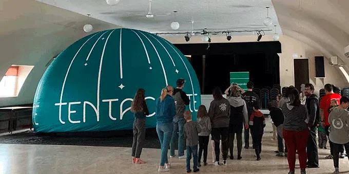
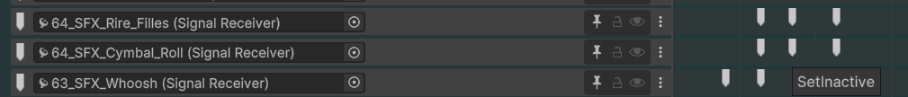
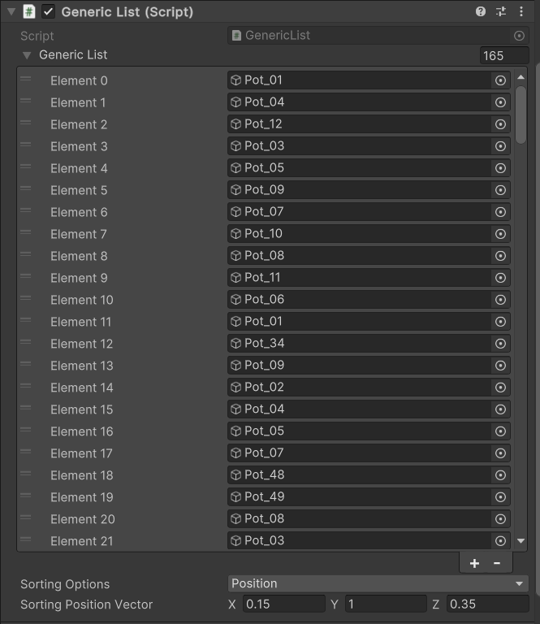
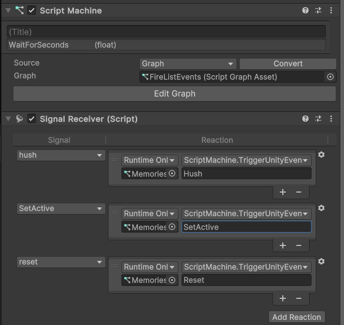
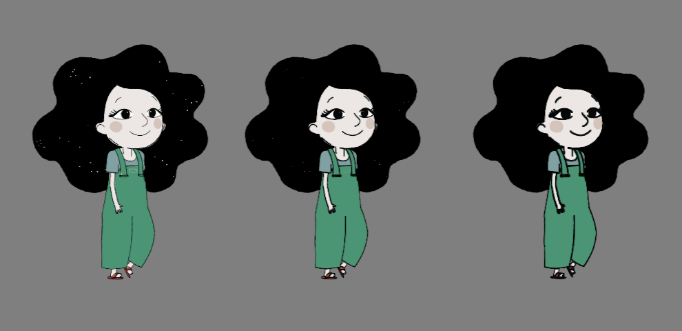
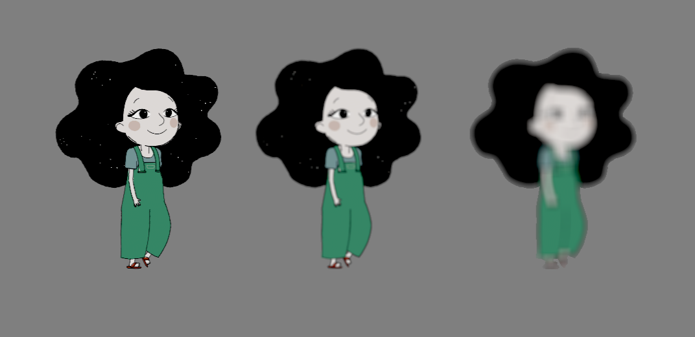
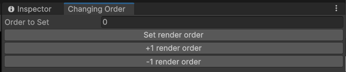

[Home](index.md) | [Projects](Projects.md) 

# Tentaconte

The Tentaconte projects that I was charged with were live-entertainment events aimed at young audiences (between 5 to 12).  
A storyteller rallies up the crowd inside a blow-up hemispherical tent on which an interractive projection is displayed.  

  

> These are **Unity** pseudo-2D interractive movies.  
> A bit of **Blender** modeling-from-images was involved  
> Storyteller training is achieved using a **VR** version of the project on the **Occulus**.

### Technology

These projects made full use of Unity's **Timeline** editor, which is a great way to make cutscenes or rythm games.  
We also used **ProBuilder**, an in-engine Unity tool for blocking (prototype-modeling)  
**Polybrush** was used to paint **VertexColor** allowing us to mask some areas and blend things with the background.  
Shoutout to **PlayModeComponentSaver**, it does exactly what it says, a true blessing.

### Hardware

Hardware included:
- different Laptops  
- midi (piano) keyboards  
- external USB numpads  
- Some sort of wireless clicker for Powerpoint presentations  
- A projector with fisheye lens  
- Busking amps with headset microphones   
- VR headsets Occulus Quests 2   

The Tentaconte has a lot of "points of failure", (if any of these things break, it all goes down the drain) so I made sure all remote hardware pieces were replaceable with Keyboard controls and that the documentation was handed to the storytellers. *The show must go on*   
Storytellers would complain as I was showing them the documentation "but I'm not gonna remember this" and I would look them in eye saying: What matters is not that you remember this, it's that you remember that the information is there, approximately what's in it, and how it's structured.    
**Institutionnal Amnesia**; the gradual decay of awareness about the existing tools and procedures can lead a business to develop the same tools over and over again. It is one of THE BIGGEST challenges we face as tool developpers. We can code the tools no problem, but That thing, That's what keeps me up at night.  

I have Live-show experience so I could help with the Amps calibration, I could assist the storytellers in getting the best vocal tone possible.  

 

### Projection  

In order to project our scene through the **fisheye lens**, I had to provide a **radial, bottom-up view** of the whole scene.  
To capture the scene we used a **Cubemap**. Lucky for us, Unity already features the **RenderToCubemap()** function . Two thumbs up.   
Now, Cubemap rendering uses the same principles as reflection probes: 6 cameras capture the scene and then wrap the result up in a texture. This is very expensive performance-wise and since the Occulus ended up choking during tests, I've restrained the rendering frequency using WaitForSeconds(). whenever the occulus chokes too hard, it spits you out of your app  
Taking the new Cubemap, we can sample it in a shader and apply it to a Dome object of preferably high resolution.
Sprinkling a bit of shader magic, I neutralized the undesired chromatic aberation, in our case it was a bichromatic yellow/blue, quite cool honestly, but it had to go.

### Importing Assets  

Using Unity's **Preset Manager** I made sure every imported texture had the proper settings right off the bat. We're talking about up to a thousand animation sprites and background assets getting imported at the same time, originating from the animated feature film "Dounia".
Then I proceeded to make some **Photoshop Scripts** to remove excess emptyness from the files.

### Audio

**Audio files** in Unity's timelines can run in 2 different ways, they can play along as the timeline unravels, or they can be triggered from objects as events in the timeline. Which implies we have no control while the timeline is stopped and we were in fact facing a few moments where the sounds and music needed to fade away smoothly during stops.  

My solution was to make some **Custom Markers** and little script to go with them to enable sound fading over time.  

Cubemap rendering has a known weakness; screenspace effects like particles's built-in look-at cause the edges of the 6 cameras to show. The solution to this is to reorient the particles to a single point in space (instead of towards the camera's *plane*) using **VertexShading**  

<video controls width="560" style="display: block; margin: 0 auto;">
  <source src="Projects/Tremblant/PortfolioTremblant.mp4" type="video/mp4">
</video>
  

  

  

  

  

  

  

 
