[About Me](index.md) | [Projects](Projects.md) 

# Tentaconte

The Tentaconte projects are live-entertainment events aimed at young audiences (between 5 to 12). A storyteller rallies up the crowd inside a blow-up hemispherical tent on which an interactive projection is displayed.  
My job was to take the visuals and storyboard provided and integrate it all together: animate, rig, code, you name it!  

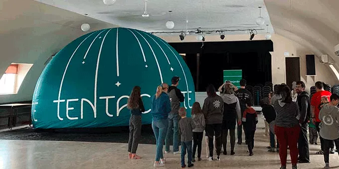  

> These are **Unity** pseudo-2D interactive movies.  
> A bit of **Blender** modeling-from-images was involved  
> A **VR** version of the project on the **Occulus** was put together for storyteller training.

### Technology

These projects made full use of Unity's **Timeline** editor, which is a great way to make cutscenes or rythm games.  
We also used **ProBuilder**, an in-engine Unity tool for blocking (prototype-modeling).  
**Polybrush** was used to paint **VertexColor** allowing us to mask some areas and blend things with the background.  
Shoutout to **PlayModeComponentSaver**, it does exactly what it says; a true blessing.

### Hardware

Hardware included:
- different laptops  
- midi (piano) keyboards  
- external USB numpads  
- wireless clicker (such as those used on Powerpoint presentations)
- projector with fisheye lens  
- busking amps with headset microphones   
- VR headsets Occulus Quests 2   

This complex hardware setup on The Tentaconte introduces lot of possible "points of failure" during live presentations. Therefore, I made sure that all remote hardware pieces were replaceable with Keyboard controls and that the documentation was handed to the storytellers to handle live emergencies. 

I also have live-show experience so I could provide help with the amps calibration and assist storytellers in getting the best vocal tone possible.  

### Projection  

In order to project our scene through a **fisheye lens**, I had to provide a **radial, bottom-up view** of the whole scene.  
To capture the scene we used a **Cubemap**. Luckily, Unity already features the **RenderToCubemap()** function. Two thumbs up!   
Cubemap rendering uses the same principles as reflection probes: 6 cameras capture the scene and then wrap the result up into a texture. This is very expensive performance-wise. Since the Occulus ended up straining during tests I've restrained the rendering frequency using WaitForSeconds().

Using this new Cubemap we can sample it in a shader and apply it to a Dome object of preferably high resolution.
Sprinkling a bit of shader magic, I neutralized the undesired chromatic aberation: in our case it was a bichromatic yellow/blue (quite cool honestly) but it had to go.

### Particles

Cubemap rendering has a known weakness; screenspace effects like particles's built-in look-at cause the edges of the 6 cameras to show. 
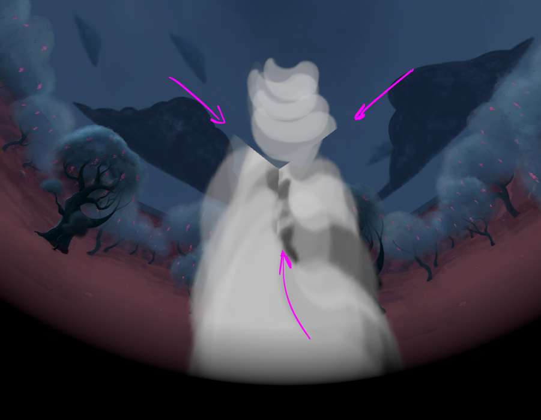  
Yikes!

The best solution to this is to reorient the particles to perform a cylindrical look-at (instead of towards the camera's *plane* or any other form of Spherical Look-at). There are 2 accessible ways of doing this without getting real hacky and extending upon Shuriken Particles, using **VertexShading** or the VFX graph.  

*(At the time I was working on this)* The VFX Graph is a fairly new addition to Unity and it still has some game-breaking bugs: 
- if you group-edit parameters, the whole parameter stack for all these object gets wiped. 
- if you switch platforms, all VFX graphs need to be manualy re-compiled.   

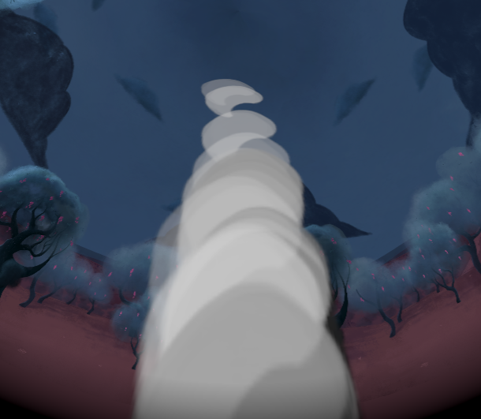  
VFX Graph fixed Axis Up solution. Sprites are skewed but displaying properly. Distortions may still be required.   

Alternatively, adding this function in a shader fixes the issue. 
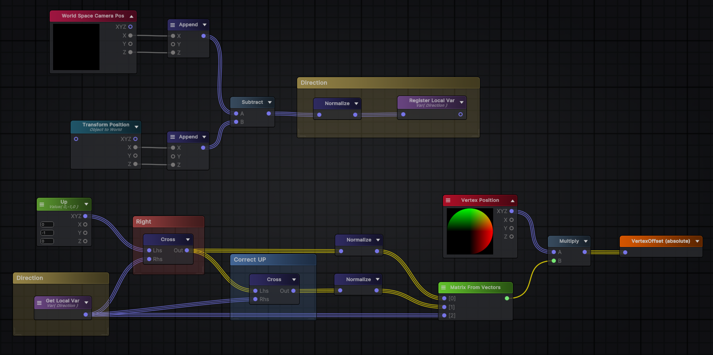  
By linking back the Y-axis of the 2 upper append nodes, we get a spherical look-at.

### Importing Assets  

Using Unity's **Preset Manager**, I made sure every imported texture had the proper settings out of the gate. We're talking about up to a thousand animation sprites and background assets getting imported at the same time, originating from the animated feature film "Dounia".  
I then proceeded to write **Photoshop Scripts** to remove excess empty space from the files.  

During the prototyping phase I concluded that **Look-At Constraints** were going to be the solution for keeping all sprite assets oriented. So I automated that too.  
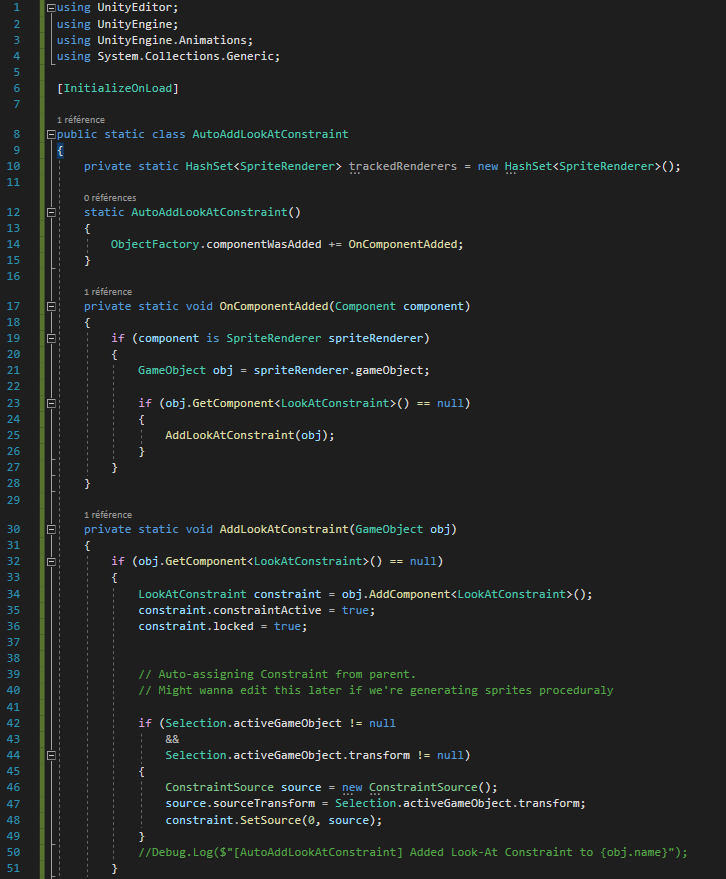  

I didn't really give any considerations to render orders and months after I had completed a scene I had to shuffle them back to accomodate screen-wide masks... it was terrible.  
I made this dockable window tool to help current and future me with this.   
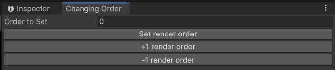  
It operates on selected object(s) and their children in hierarchy.

### Audio

**Audio files** in Unity's timelines can run in 2 different ways: they can play along as the timeline unravels, or they can be triggered from objects as events in the timeline. This implies that we have no control while the timeline is stopped and were in fact facing a few moments where the sounds and music needed to fade away smoothly during stops.  
It's important to factor-in the possibility of rewinding the timeline

My solution was to make some **Custom Markers** and a little script to go with them to enable sound fading over time.  

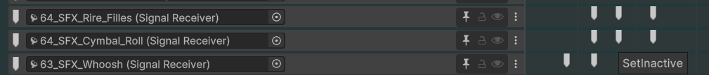  

I made around 40% of one of the project's sounds! Mario64-style recycling potentialy saved us days.  

### Shaders

With the exception of that one hair strand from Dounia's facial animation loop, The entirety of her hair is made of maths. 

<video controls width="560" style="display: block; margin: 0 auto;">
  <source src="Projects/TheTentaconte/DouniaHair1.mp4" type="video/mp4">
</video>

<video controls width="560" style="display: block; margin: 0 auto;">
  <source src="Projects/TheTentaconte/DouniaHair2.mp4" type="video/mp4">
</video>

We were losing our character's facial expressions to the projector's natural resolution and blur... They were simply displayed too small.   
So I had the idea to recycle an old averaged-Blur function I had designed and switch-out its blending to turn it into an Embolden function instead.

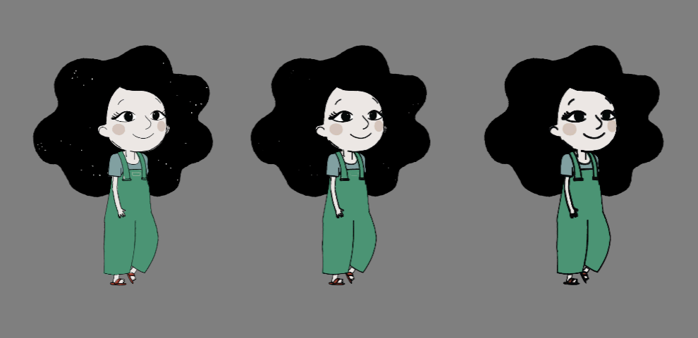  

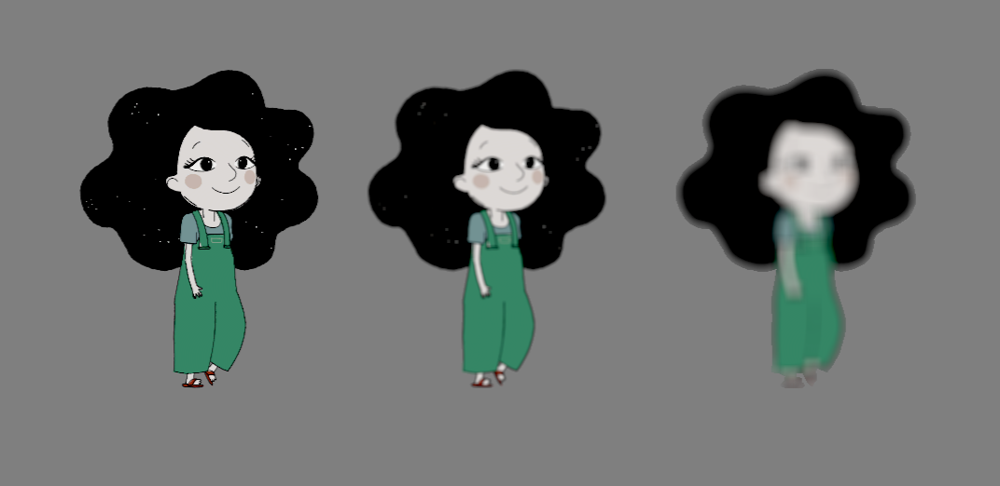  
Blur! It's really nice when used with Screen Grabs.

### Propagation System

What I call Propagation in this context is a short network of events and tweens.

1. The **timeline** sends these **events**: Play, Stop and ForceShutDown.  
2. Objects are **pooled** and **sorted** *spatialy in this case: by a mix of X, Y and Z axis*.  
3. A Master object receives the timeline events and fires similar events to individual objects in the group, at calculated intervals, *using curves for that progressive drop*.  
At any given time the storyteller can navigate to the previous or next notch in the timeline so both peaceful and forceful interruptions apply.  
4. Slave objects trigger animations on themselves. I opted for **tweens** using visual scripting but running animators animations would've been an equaly viable option.

<video controls width="560" style="display: block; margin: 0 auto;">
  <source src="Projects/TheTentaconte/Propagation.mp4" type="video/mp4">
</video>
Lots of cheese in pots  

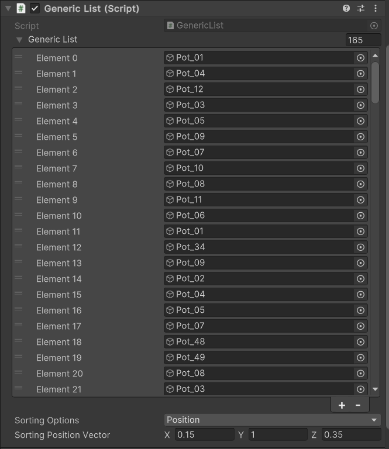  
Listing and sorting cheese pots

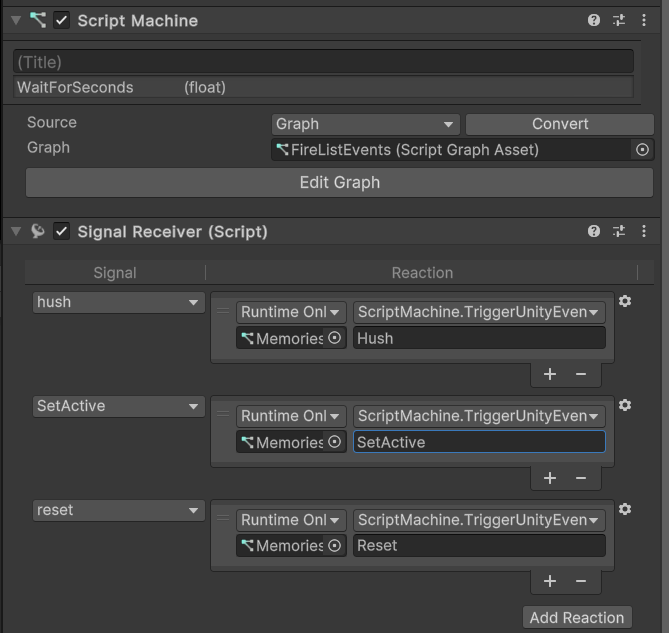  
My original event names are bad

I also made a tool to help 2D artists visualize how their images were going to look on-site.  

All together, The Tentaconte Simulator is a standalone application that requires no knowledge of Unity to run.

<video controls width="560" style="display: block; margin: 0 auto;">
  <source src="Projects/TheTentaconte/PortfolioTentaconteSimulator.mp4" type="video/mp4">
</video>  
