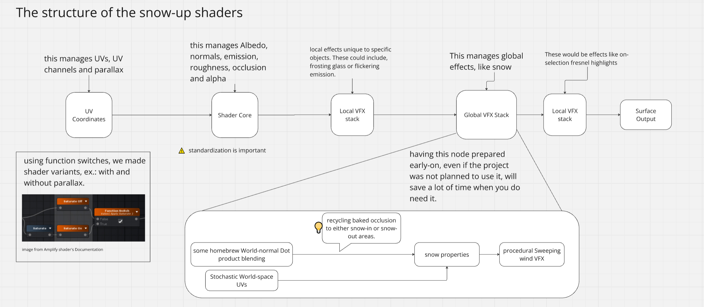

[Home](index.md) | [Projects](Projects.md) 

# Tentaconte

The Tentaconte projects that I was charged with were live-entertainment events aimed at young audiences (between 5 to 12).  
A storyteller rallies up the crowd inside a blow-up hemispherical tent on which an interractive projection is displayed.  
The storyteller can practice using a training VR version of the project.  

>These are **Unity** pseudo-2D interractive movies.

Hardware included:
- different Laptops
- midi (piano) keyboards
- external USB numpads
- Some sort of wireless clicker for Powerpoint presentations
- A projector with fisheye lens
- Busking amps with headset microphones
- VR headsets Occulus Quests 2 

These projects made full use of Unity's **Timeline** editor,  
We also used **ProBuilder**, an in-engine Unity tool for Blocking (prototype-modeling)  
**Polybrush** was used to paint **VertexColor** allowing us to mask some areas and blend things with the background.  

 

In order to project our scene through the **fisheye lens**, I had to provide a **radial, bottom-up view** of the whole scene.  
To capture the scene we used a **Cubemap**. Lucky for us, Unity already features the **RenderToCubemap()** function . Two thumbs up.   
Now, Cubemap rendering uses the same principles as reflection probes: 6 cameras capture the scene and then wrap the result up in a texture. This is very expensive performance-wise and since the Occulus ended up choking during tests, I've restrained the rendering frequency using WaitForSeconds(). whenever the occulus chokes too hard, it spits you out of your app  
Taking the new Cubemap, we can sample it in a shader and apply it to a Dome object of preferably high resolution.
Sprinkling a bit of shader magic, I neutralized the undesired chromatic aberation, in our case it was a bichromatic yellow/blue, quite cool honestly, but it had to go.

Using Unity's **Preset Manager** I made sure every imported texture had the proper settings right off the bat. We're talking about up to a thousand of animation sprites and background assets getting imported at the same time, originating from the animated feature film "Dounia".
Then I proceeded to make some **Photoshop Scripts** to remove excess emptyness from the files. 

**Audio files** in Unity's timelines can run in 2 different ways, they can play along as the timeline unravels, or they can be triggered from objects as events in the timeline. Which implies we have no control while the timeline is stopped and we were in fact facing a few moments where the sounds and music needed to fade away smoothly.  

The solution was to make some **Custom Markers** and little script to go with them to enable sound fading over time.  

Cubemap rendering has a known weakness; screenspace effects like particles's built-in look-at cause the edges of the 6 cameras to show. The solution to this is to reorient the particles to a single point in space (instead of towards the camera's *plane*) using **VertexShading**  

<video controls width="560" style="display: block; margin: 0 auto;">
  <source src="Projects/Tremblant/PortfolioTremblant.mp4" type="video/mp4">
</video>
  

Here is how I approached this:  
- The whole system is triggered by a single **Global shader property**  
- It all operates at **surface shading** level.  
- The structure of all the project's shaders follow this pattern:  
  

 
