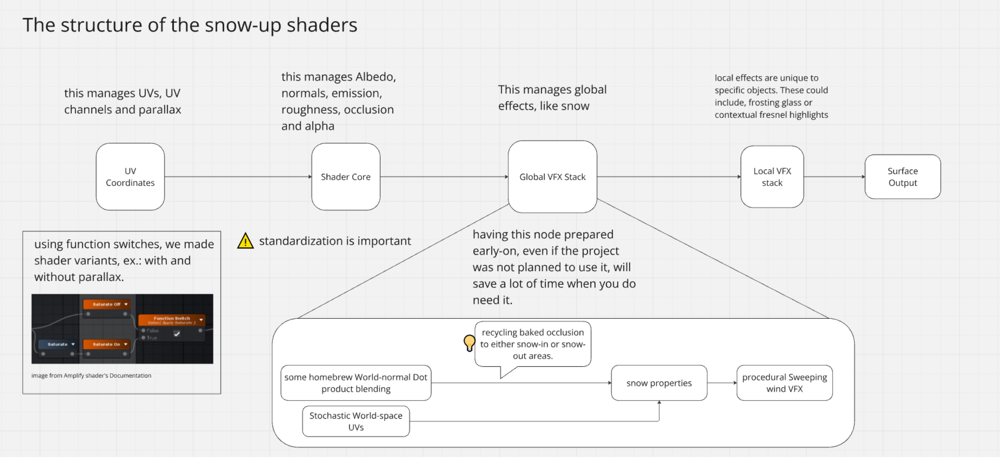

[Home](index.md) | [Projects](Projects.md) 

# Tremblant

For this project I was awoken from my slumber to snow up the entire project. 

>This is a **Unity real-time Archviz** simulation.

 

<video controls width="560" style="display: block; margin: 0 auto;">
  <source src="Projects/Tremblant/PortfolioTremblant.mp4" type="video/mp4">
</video>
  

Here is how I approached this:  
- The whole system is triggered by a single **Global shader property**  
- It all operates at **surface shading** level.  
- The structure of all the project's shaders follow this pattern:  
  

 

Sky colors as well as sunset and sunrise positions needed to be adapted to the reduced daytime that happens during Quebec winters.  
I planned what needed to be done and how but I did not personnaly execute this part.  

fun fact about inspecting performances on this project is that we struggled finding why we were CPU-bound causing odd little lag spikes rippling out to GPU before realizing it was our own FPS Cap: "Application.targetFrameRate = *whatever*"

 

It's snowing despite not being quite cloudy enough for it, I can't remember who asked for this.   
The snow particles's spawner forms a box around the camera, just big enough so that if you move the camera around we don't lose the effect. It's nothing fancy. Performances were good enough that we could let them stick around a little bit on surfaces before letting them melt away.  

 

<video controls width="560" style="display: block; margin: 0 auto;">
  <source src="Projects/Tremblant/PortfolioTremblant2.mp4" type="video/mp4">
</video>
  

 

These are the actual sunsets and sunrise positions for both summer and winter at this location, somewhere on Mont Tremblant.  

<video controls width="560" style="display: block; margin: 0 auto;">
  <source src="Projects/Tremblant/PortfolioTremblant3.mp4" type="video/mp4">
</video>
This is one of the rare times I've worked with someone else on lighting on a project, I think we did good.  

 

Notice in the following video how some surfaces get disconnected (right above the gizmo's green arrow) from the rest of the object while the displacement occurs. This is because assets need to be prepared with contiguous normals (or a proxy map of this) in order for snow accumulation to reach its full potential.  

video controls width="560" style="display: block; margin: 0 auto;">
  <source src="Projects/Tremblant/Snow.mp4" type="video/mp4">
</video>
  

 
