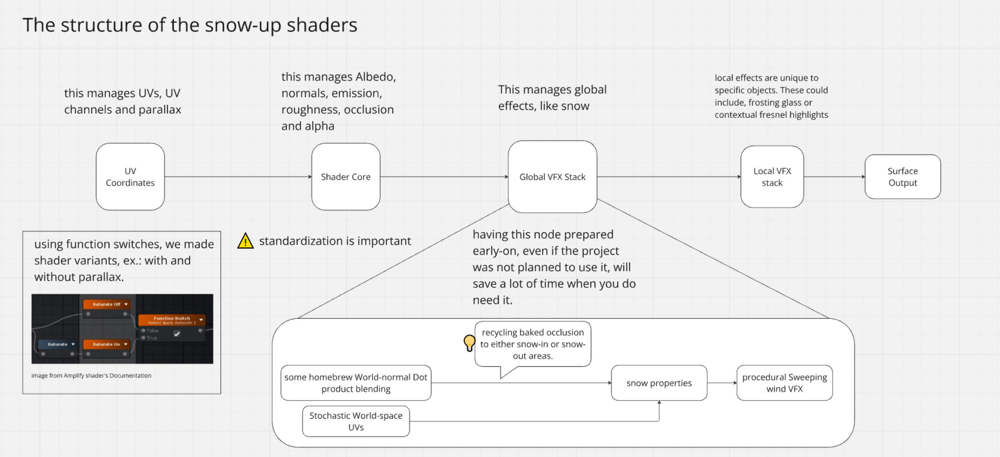

[About Me](index.md) | [Projects](Projects.md) 

# Realtime dynamic weather system

For this project my task was to convert an entire project from summer to winter and vice-versa, dynamicaly. 
I was also tasked with profiling performances and ensuring the app ran smooth.

>This is a **Unity real-time Archviz** simulation.

<video controls width="560" style="display: block; margin: 0 auto;">
  <source src="Projects/Tremblant/PortfolioTremblant.mp4" type="video/mp4">
</video>

Here was my approach:  
- Introduce a single **Global shader property** to control the whole system.  
- Operate at **surface shading** level.  
- Conforming most of the project's shaders structure to follow this pattern:  
  

A snow particles' spawner forms a box around the camera, just big enough that if you move the camera around we don't lose the effect. Performances were good enough that we could enable collisions, letting them stick around a little bit on surfaces before fading away.  

<video controls width="560" style="display: block; margin: 0 auto 20px auto;">
  <source src="Projects/Tremblant/PortfolioTremblant2.mp4" type="video/mp4">
</video>

## Location Accurate Environment

These are the actual sunsets and sunrise positions for both summer and winter at this location, somewhere on Mont Tremblant.  

Sky colors as well as sunset and sunrise positions were adapted to the reduced daytime that happens during Quebec winters.  
I was involved in design and planning for this feature. Coding was done by other colleagues. I did configure the results.

<video controls width="560" style="display: block; margin: 0 auto 20px auto;">
  <source src="Projects/Tremblant/PortfolioTremblant3.mp4" type="video/mp4">
</video>

## Sample Prototype Snow

Notice in the following video how some surfaces get disconnected (right above the gizmo's green arrow) from the rest of the object while the displacement occurs. This is because assets need to be prepared with contiguous normals (or a proxy map of this) in order for snow accumulation to reach its full potential.  

<video controls width="560" style="display: block; margin: 0 auto;">
  <source src="Projects/Tremblant/Snow.mp4" type="video/mp4">
</video>
Proto-Snow: Version not final  

