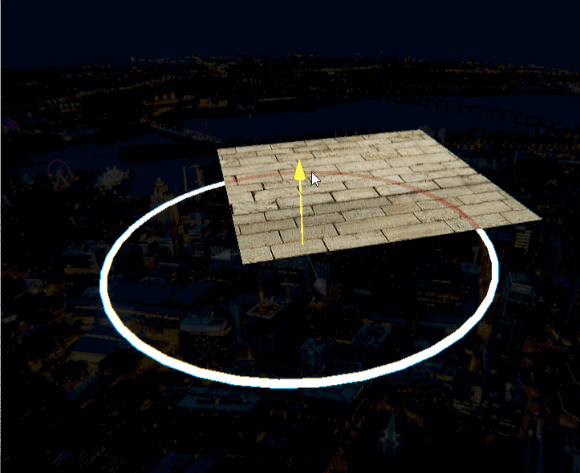

[Home](index.md) | [Projects](Projects.md) 

>This a **Unity amplify shader** VFX minikit with some 3d models 

Every once in a blue moon a client hits you with some Cyberpunk-grade "this is an experience" design.  
These, are, **AWESOME**.

 
 Using photoshop to subdivide a circle into equidistant lines of equal lenght gave me an idea: what if I used Vertex Color on torusses to do exactly that? 
  

So, combining multiple rudimentary shapes: Quads, Circles, Hexes, Squares and Triangles, you can quickly produce a variety of dynamic UI pins and gizmos. 

<video controls width="560" style="display: block; margin: 0 auto;">
  <source src="Projects/VFX/UIReticle2.mp4" type="video/mp4">
</video>
 Fire some missiles!  

 

Typicaly, clients like these better though:

<video controls width="560" style="display: block; margin: 0 auto;">
  <source src="Projects/VFX/LozengePin2.mp4" type="video/mp4">
</video>
 Elegant, simple, chef's kiss

 
<video controls width="560" style="display: block; margin: 0 auto;">
  <source src="Projects/VFX/HexPin.mp4" type="video/mp4">
</video>
 I can do this all day, but I don't have to! it only takes 15 minutes to pop one of these bad boys

 
There's often quite a fuss over world-space UI elements about whether or not to render them on top of the rest of the geometry. 
Depending on how crowded the visuals are, I tend to lean towards partial fading.

  

