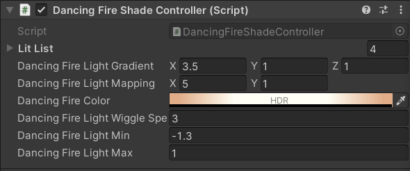
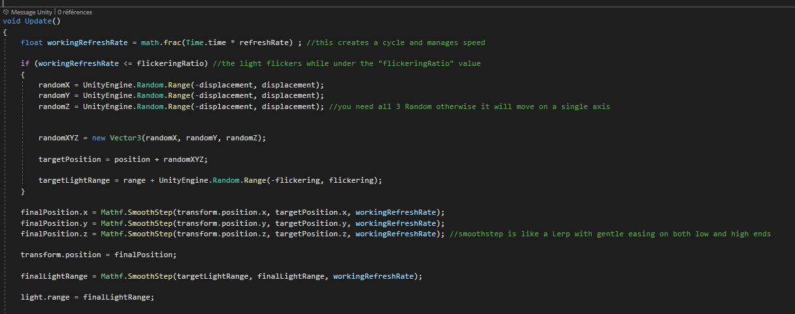
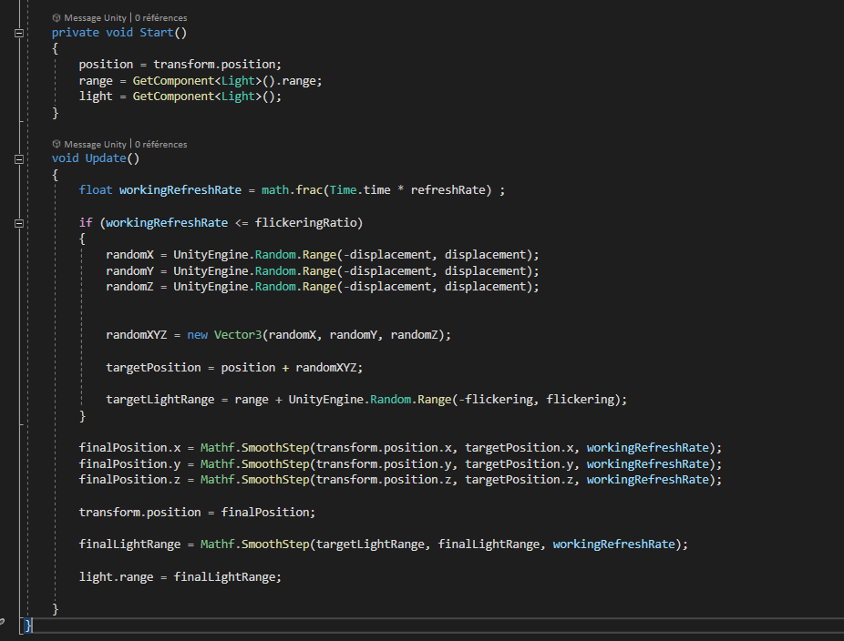
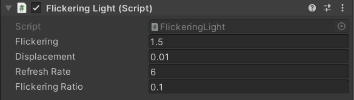
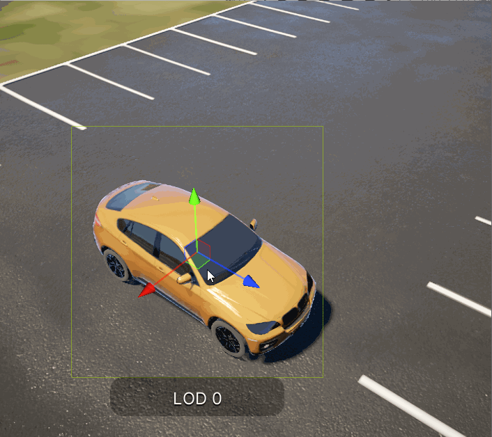
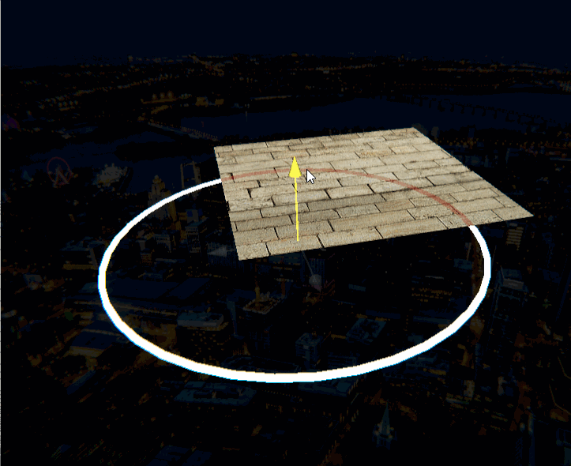

[About Me](index.md) | [Projects](Projects.md) 

# VFX

## Waterfall and Fountains

I was mandated to produce fountains and a waterfall for one of Smartpixel's app.  
The fountains and splashes are pretty standard shuriken particles with depth-fading and a 4-frame animation etched at the speed of light in Krita Krita is an open source photoshop.   
They use some custom normal-handling equations for slightly more consistently plausible tints for when they're lit vs under the shade.  

<video controls width="560" style="display: block; margin: 0 auto;">
  <source src="Projects/VFX/Waterfall.mp4" type="video/mp4">
</video>

Final version

I made a pretty decent prototype before tackling the real thing in HLSL for their custom rendering engine.  
A big bummer for me was that they saved so little budget for this that I had to cut on the foam feature in the waterfall shader altogether, which would've made it much more versatile for future cases.  

<video controls width="560" style="display: block; margin: 0 auto;">
  <source src="Projects/VFX/WaterfallProto.mp4" type="video/mp4">
</video>

Prototype version with additionnal foaming and tweaks

My reference was foaming, clumping, and flowing faster on the sides which got me scratching my head for a few minutes there. 

## Firepit

This fire VFX was designed specificaly for firepits. It is textured in worldspace offering ease of scalability and constant aspect for its texture.
It is composed of 5 quads. 2 for both the X and Z axis and another one facing upwards.  

It's important to note that these projects' lux range varies from ~50lux at night to ~150 000lux at day as they are using physicaly-based light ranges. With this level of variation, most vfx and world-space UI shaders need some degree of adaptation.  

This version of the shader was conformed to Smartpixel's real estate needs: a cozy flame, with a clean rich-feel, minimal smoke and no unruly embers. Chic and perfectly under control.

<video controls width="560" style="display: block; margin: 0 auto;">
  <source src="Projects/VFX/DancingFireSeq.mp4" type="video/mp4">
</video>

Final version

This one is still under development, it features particles for embers, thicker smoke and an extra camera-facing quad for heat deformation.  

<video controls width="560" style="display: block; margin: 0 auto;">
  <source src="Projects/VFX/DancingFire.mp4" type="video/mp4">
</video>

WIP version with new features

Notice the light variations, I am using a regular point light with a script I've written that moves it erraticaly and changes its intensity over time.  
Coupled with it, I am also working on a shader feature that ultimately would work as a shrink-wrap decal making use of Unity's animatable voronoi noise to add an organic touch to the light, bringing us closer to the dancing shadows that a firepit casts.  

For the time being, it's in the form of a global-parameter feature applied on the neighboring surfaces. Until I start working on the decal system.
 
  

  

  

  

## Automatic Colorizer

Automatic Colorizer is a shader feature that randomizes props' colors depending on their world position. It's a neat trick to add variations for static trees and any prefab that appears repeatedly in the background.  
The color could be applied dynamicaly on spawn if the cars were animated, but alas, they weren't. 
This one is handling colors only but it's possible to distort meshes and create all manners of variations without introducing new draw calls in the render queue.
This specific case is sampling a micro 16x16 texture to use as color palette, which still provides a whopping 256 variations. 

  
The Car shader also has a nice shellac material! but this on-the-fly gif does it no justice

## Item Box 

I produced this item box by doing as much as I could in-shader as a fun lightweight challenge.  
the dots and their normals are mathematical equations.   
the exclamation mark is a texture though, but its look-at constraint and its animation are done in-shader.  
the transparency quality, sorting and layering is guaranteed using vertex color to differentiate the external surface from the internal one.  

<video controls width="560" style="display: block; margin: 0 auto;">
  <source src="Projects/VFX/MysteryCube.mp4" type="video/mp4">
</video>

## Autochamfering

Autochamfering was a crutial upgrade to our Archviz projects, Unchamfered edges are a well documented realism-killer.  

There are essentialy 3 rationnal ways to do auto-chamfering; 
- dedicating a UV channel for it and scripting a tool to map out the object's vertices onto virtual shapes.
- using a guide texture 
- using a post-process that is very similar to occlusion in principle and execution.

Our pipeline was still using channel-packed textures so my solution was to use the alpha channel of one of them to use as a guide texture. 
This solution is both quick to implement and to use for people in production.

<video controls width="560" style="display: block; margin: 0 auto;">
  <source src="Projects/VFX/EdgeMapping.mp4" type="video/mp4">
</video>

# UI

## Next-Level User Experience

Every once in a while a client hits you with some Cyberpunk-grade "*this is an experience*" design.  
These, are, **AWESOME**. Often times they will feature extensive motion design added to their UI experience, with quirky animated gizmos or transitions.
Typically, these designs share a base set of common animation "rules" such as expansions, shapes completions, fades, etc.

Check out the following videos for examples for custom UI FX requests in application.

<video controls width="560" style="display: block; margin: 0 auto;">
  <source src="Projects/VFX/UIReticle2.mp4" type="video/mp4">
</video>

Fire some missiles!

Or a more typical transition animation, highly appreciated by clients :

<video controls width="560" style="display: block; margin: 0 auto;">
  <source src="Projects/VFX/LozengePin2.mp4" type="video/mp4">
</video>

Elegant, simple, chef's kiss

<video controls width="560" style="display: block; margin: 0 auto;">
  <source src="Projects/VFX/HexPin.mp4" type="video/mp4">
</video>

I can do this all day... but I don't have to! It only takes about 15 minutes to configure one of these bad boys now.

## Solution

> The tool I created is a **Unity amplify shader** VFX minikit combined with some 3d models.

Using photoshop to subdivide a circle into equidistant lines of equal lenght gave me an idea: what if I used Vertex Color on torusses to do exactly that?

So, combining multiple rudimentary shapes: Quads, Circles, Hexes, Squares and Triangles, we can quickly produce a variety of dynamic UI pins and gizmos. All using the same tool.

There's often quite a fuss over world-space UI elements, about whether or not to render them on top of the rest of the geometry. 
Depending on how crowded the visuals are, I tend to lean towards partial fading.

  

