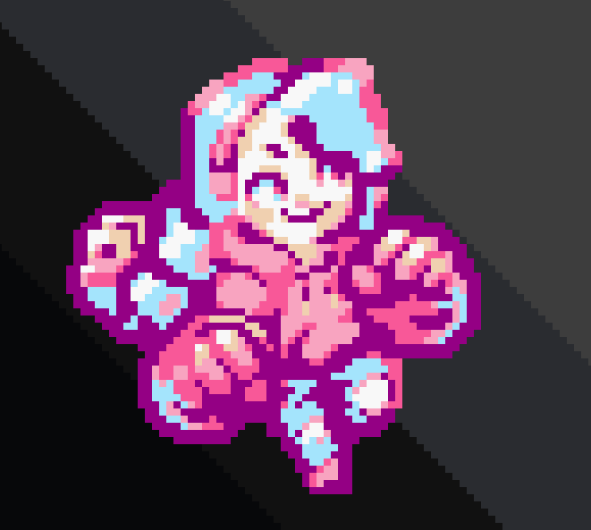

[Home](index.md) | [Projects](Projects.md) 

<!-- 
<nav>
  <a href="/">Home</a>
  <a href="/About">About</a>
  <a href="/Projects">Projects</a>
</nav>
-->

 Hi! I'm a **lighting** and **Technical artist**

    
 

I was rigging models in my basement with my 3D arts college degree and then one day I was swept into the wonderful world of Archviz.  
I made a lot of buildings, of course, but more importantly I ended up working on **shaders**, **cameras**, **lighting**, **VFX**, **performances**, **tools** and assembling scenes (placing props, making things nice and cozy etc.)  

Then I had the chance to work solo-dev on a few projects with the people from Tobo Studio.  
That required me to learn how to fix a lot of software and hardware related issues.  

<!-- 
Then I had the chance to work solo-dev on a few projects with the people from Tobo Studio.  
That required me to learn how to fix a lot of software and hardware related issues like:
- preventing laptops from overheating,  
- building apps for VR,  
- compensating for fisheye lens chromatic aberation,  
- Windows 11,  
- My favorite: Finding out an external USB numpad is sending alphanumerical signals.  
-->
I'm very excitable about a few things:  
- working in game engines, any in-engine job.  
- stylization, or look-dev.   
- tasks that make me say "Yes! it's working!"

I'm currently living in Montreal.   
You can reach me through **Croquettelunchers@gmail.com**   

 

Click the links below

  <a href="Megan"><big>[Megan Videogame]</big> 
  
     
  <a href="FakeInteriors">
    <a href="FakeInteriors"><big>[Interior Shader]</big> 
    
  </a>
     
  <a href="Interiors">
    <a href="Interiors"><big>[Baked Interiors Lighting]</big> 
    
  </a>
     
  <a href="VFX">
    <a href="VFX"><big>[UI Gizmos VFX]</big> 
    
  </a>
     
  <a href="Tremblant">
    <a href="Tremblant"><big>[Snow-Up Shaders]</big> 
    
  </a>
     
  <a href="Tentaconte">
    <a href="Tentaconte"><big>[Tentaconte]</big> 
    
  </a>
     
  <a href="Lighting">
    <a href="Lighting"><big>[Lighting]</big> 
    
  </a>
     

